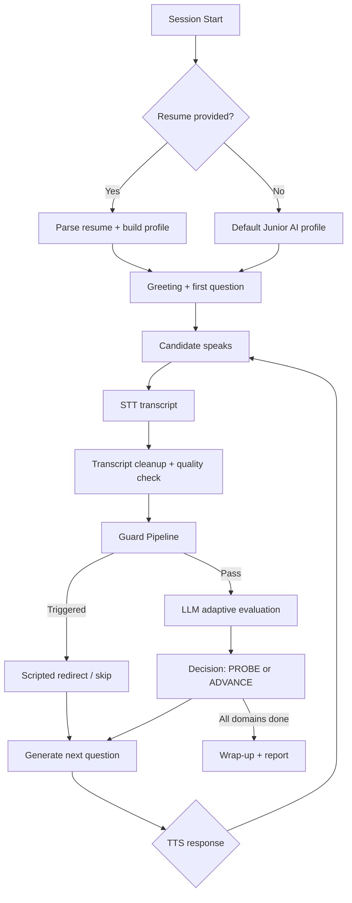
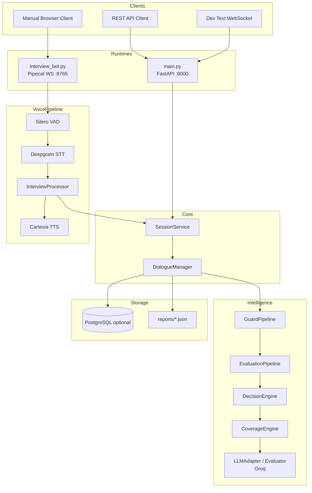
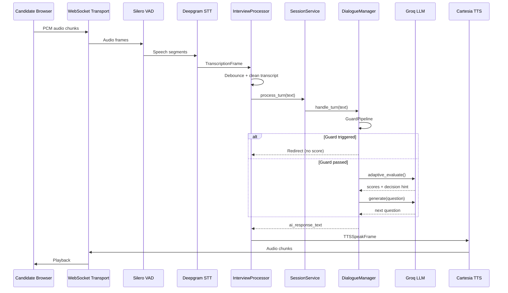
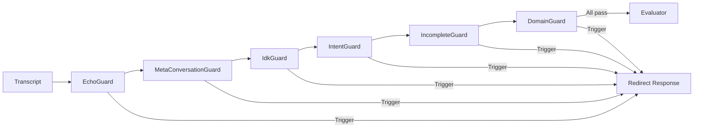

# AI-Based Real-Time Interview Simulator with Adaptive Questioning and Automated Evaluation

**Final Year Project Report**

---

| Field | Detail |
|-------|--------|
| **Project Title** | AI-Based Real-Time Interview Simulator with Adaptive Questioning and Emotion Analysis |
| **Institution** | Hamdard University Islamabad |
| **Supervisor** | Engineer Usman Javed |
| **Team** | Muhammad Usman, Taimur Ali Sakhawat, Bismah Khan Bangash, Eimaan Khan Bangash |
| **Academic Year** | 2025–2026 |
| **Repository** | `AI-interviewer-fyp-v2` |
| **Report Version** | 1.0 — reflects implementation through Phase 6C + voice hotfix (commit `852bf7e`) |
| **Primary LLM** | Groq (`llama-3.3-70b-versatile`) — *not Google Gemini* |

---

## Abstract

This report documents the design, implementation, evolution, and evaluation of an AI-powered real-time voice interview simulator aimed at Junior AI Engineer candidates. The original FYP proposal envisioned a multimodal system combining speech recognition, adaptive dialogue, speech-emotion recognition (SER), facial expression analysis, and fairness-aware automated reporting. The delivered system implements a production-oriented voice interview pipeline using Pipecat, Deepgram STT, Cartesia TTS, Silero VAD, and Groq-based LLM evaluation, with a structured ten-domain interview blueprint, guard-rich dialogue management, and thesis-ready scoring methodology.

The implementation deliberately evolved from the proposal: emotion and facial analysis were deferred in favour of text-based behavioural scoring via a six-dimension rubric; full Item Response Theory (IRT) and Computerised Adaptive Testing (CAT) were replaced by a practical Q-matrix blueprint; and the React/Firebase stack was replaced by FastAPI, optional PostgreSQL, and a lightweight browser manual client. These changes improved feasibility, reduced latency, and produced a demonstrable end-to-end voice interview with automated JSON reports suitable for academic evaluation.

**Keywords:** Voice interview simulator, adaptive questioning, speech-to-text, Pipecat, LLM evaluation, interview automation, FYP

---

## Table of Contents

1. [Introduction](#1-introduction)
2. [Literature Review](#2-literature-review)
3. [System Analysis](#3-system-analysis)
4. [System Design](#4-system-design)
5. [Implementation](#5-implementation)
6. [Project Evolution](#6-project-evolution)
7. [AI Technologies Used](#7-ai-technologies-used)
8. [Project Structure](#8-project-structure)
9. [Testing](#9-testing)
10. [Results](#10-results)
11. [Future Work](#11-future-work)
12. [Conclusion](#12-conclusion)

---

## 1. Introduction

### 1.1 Background

Technical hiring for AI and machine learning roles increasingly relies on structured interviews that assess both communication and technical depth. Traditional mock interviews require human interviewers, are difficult to scale, and introduce inconsistency in questioning and scoring. Recent research (MockLLM, InterviewBot, InterviewEase) demonstrates that large language models can conduct plausible technical interviews, but most systems lack robust real-time voice interaction, interruption handling, and fairness-aware evaluation pipelines.

The FYP proposal *"AI-Based Real-Time Interview Simulator with Adaptive Questioning and Emotion Analysis"* addressed this gap by proposing a voice-first platform where candidates speak naturally, the system adapts follow-up questions based on answers, and multimodal signals (speech tone, facial expressions) inform behavioural assessment.

### 1.2 Problem Statement

Candidates preparing for AI engineering roles lack accessible, realistic, and repeatable interview practice environments. Existing tools often provide static question banks, text-only chatbots, or generic HR screening without domain-specific adaptive probing. Furthermore, automated systems frequently fail to handle:

- Real-time speech with acceptable latency
- User interruptions (barge-in) during AI speech
- Noisy or fragmented speech-to-text output
- Off-topic, meta-conversational, or incomplete answers
- Fair scoring when transcript quality is poor

The project set out to build a system that conducts a **live voice interview**, asks **context-aware follow-up questions**, handles **interruptions**, and produces a **structured performance report** — while remaining thesis-defensible and technically feasible within an undergraduate timeline.

### 1.3 Motivation

1. **Educational value** — Students and junior engineers need low-cost practice aligned with real hiring expectations.
2. **Research alignment** — Literature on adaptive testing (IRT/CAT), slot-filling dialogue, and LLM-as-interviewer motivates a structured but practical implementation.
3. **Technical challenge** — Integrating streaming STT, TTS, VAD, dialogue guards, and LLM evaluation in one pipeline is a substantial systems-engineering problem.
4. **Fairness** — Automated hiring tools must acknowledge bias; the project incorporates explicit bias-awareness sections and noisy-transcript score adjustment.

### 1.4 Objectives

| # | Original Proposal Objective | Implementation Status |
|---|----------------------------|----------------------|
| O1 | Real-time voice interview simulation | **Achieved** — Pipecat pipeline with Deepgram + Cartesia |
| O2 | Dynamic adaptive questioning | **Achieved** — CoverageEngine + DecisionEngine + Groq LLM |
| O3 | Real-time interruption handling | **Partially achieved** — Client/server barge-in; not full stress simulation |
| O4 | Emotional & behavioural evaluation | **Partially achieved** — LLM scores clarity/confidence from text; no SER/facial models |
| O5 | Automated interview reporting | **Achieved** — JSON reports, HR summaries, domain assessment maps |
| O6 | Performance & reliability evaluation | **Achieved** — Regression suite, latency optimisations, live testing |

### 1.5 Scope

**In scope (delivered):**

- Live browser-based voice interview (primary demo path)
- REST API for text-based testing and report retrieval
- Junior AI Engineer interview blueprint (10 domains)
- Optional resume-aware question personalisation
- Pre-evaluation guard pipeline (six guards)
- Six-dimension LLM rubric with borderline rethink ensemble
- Communication vs technical score separation in reports
- Optional PostgreSQL persistence
- Human-study export for inter-rater agreement validation

**Out of scope (deferred or not implemented):**

- Speech Emotion Recognition (MFCC/CNN models)
- Facial expression analysis via webcam
- Full IRT/CAT psychometric engine
- React production frontend
- Docker/containerised deployment
- Google Gemini integration (Groq used instead)
- Multi-candidate concurrent voice sessions

---

## 2. Literature Review

### 2.1 Existing Solutions

The proposal surveyed eleven primary references spanning mock interview platforms, voice+facial analysis apps, and fairness in algorithmic hiring. Key themes from the literature and supplementary review documents (`interview_extracted.txt`, `Evaluation__extracted.txt`, `system_extracted.txt`, `conversation_extracted.txt`) include:

| Theme | Representative Work | Relevance |
|-------|---------------------|-----------|
| Real-time mock interviews | Khapekar et al. (2025), TIJER (2025) | Validates demand for AI interview practice |
| Voice + multimodal analysis | Jagtap et al. (2025), Amrutha et al. (2024) | Motivated SER/facial modules in proposal |
| LLM interview agents | MockLLM (Sun et al.), InterviewBot (Wang et al.) | Informed dialogue + evaluation architecture |
| Resume-aware screening | Koshti et al. (2025), InterviewEase (Kothari et al.) | Supported optional resume bootstrap |
| Hiring fairness | Raghavan et al. (2019) | Motivated bias-awareness in reports |
| Adaptive testing theory | IRT, 3PL, Q-matrix, CAT literature | Informed blueprint design; full CAT deferred |
| LLM evaluation validation | SWE-Judge, Cohen's κ studies | Informed rethink ensemble and human-study export |

### 2.2 Related Work Comparison

| Feature | Typical LLM Chatbot Interviews | Commercial Mock Platforms | **Our System (Implemented)** |
|---------|------------------------------|---------------------------|------------------------------|
| Voice interaction | Rare / add-on | Sometimes | **Core path (Pipecat)** |
| Adaptive follow-ups | Basic prompt chaining | Human-scripted | **Guard + coverage + LLM** |
| Domain blueprint | Ad hoc | Job-specific templates | **10-domain Junior AI blueprint** |
| Interruption handling | Minimal | N/A | **Barge-in + VAD** |
| Emotion from audio | No | Some | **Not implemented** |
| Scoring transparency | Opaque | Rubric-based | **6-dimension rubric + trace** |
| Resume personalisation | Sometimes | Yes | **Optional at session start** |
| Psychometric CAT | No | Rare | **Practical Q-matrix only** |

### 2.3 Comparison with Proposed System

The proposal architecture envisioned:

```
Candidate Voice → STT → NLU (intent/emotion) → Dialogue Manager → TTS
                  ↓
         Emotion/Behaviour Analysis → Report → Database
```

The **implemented architecture** replaces NLU emotion models with a **guard pipeline + LLM evaluator**, uses **Groq** instead of a generic NLU stack, and stores reports as **JSON files** with optional PostgreSQL. This is a deliberate engineering trade-off: the delivered system is stronger on **dialogue robustness and evaluation methodology** and weaker on **multimodal affect sensing**.

---

## 3. System Analysis

### 3.1 Functional Requirements

| ID | Requirement | Implementation |
|----|-------------|----------------|
| FR-01 | Start an interview session with optional resume | `SessionService.create()`, `session_bootstrap.py`, manual client form |
| FR-02 | Conduct real-time voice Q&A | `interview_bot.py`, Deepgram STT, Cartesia TTS |
| FR-03 | Ask adaptive follow-up questions | `DecisionEngine`, `CoverageEngine`, `Evaluator.adaptive_evaluate()` |
| FR-04 | Detect and handle non-answer utterances | `GuardPipeline` (echo, meta, IDK, intent, incomplete, domain) |
| FR-05 | Score answers on multiple dimensions | `evaluation/rubric.py`, Groq evaluator |
| FR-06 | Generate final interview report | `analytics.generate_final_report()` |
| FR-07 | Support text-only interview via API | `main.py` `/start`, `/chat` |
| FR-08 | Retrieve HR-facing summary | `GET /report/hr/{id}`, `recruiter_report.py` |
| FR-09 | Export data for human validation study | `GET /export/human-study/{id}` |
| FR-10 | Allow candidate to skip domain / request next question | `MetaConversationGuard`, `SKIP_REQUEST` intent (Phase 6) |

### 3.2 Non-Functional Requirements

| ID | Requirement | Proposal | Implementation |
|----|-------------|----------|----------------|
| NFR-01 | Low latency voice loop | < 2s response | Achieved with async `to_thread` + streaming TTS; machine-dependent |
| NFR-02 | Reliability on reconnect | Not specified | Voice hotfix: no `EndFrame` teardown on disconnect |
| NFR-03 | Configurability | Environment-based | Central `Settings` dataclass, `.env` |
| NFR-04 | Fairness / bias awareness | GDPR, ISO mentioned | Report `bias_awareness` section; noisy-STT weight adjustment |
| NFR-05 | Scalability | Cloud deployment | Single-client WS; multi-tenant not implemented |
| NFR-06 | Maintainability | Modular design | Phased architecture (Phases 1–6), regression harness |

### 3.3 Use Cases

#### UC-01: Candidate conducts voice interview

1. Candidate opens manual client in browser.
2. Grants microphone permission; WebSocket connects to `ws://localhost:8765`.
3. Bot speaks greeting (Cartesia TTS).
4. Candidate answers; audio streams to server.
5. Deepgram produces transcript; `InterviewProcessor` debounces and forwards to dialogue engine.
6. System evaluates, selects next question, speaks response.
7. On completion or disconnect, JSON report is saved and served at `/latest-report`.

#### UC-02: Developer tests via REST API

1. `POST /start` with optional `resume_text`, `target_role`.
2. `POST /chat` with `session_id` and candidate message.
3. `GET /report/{session_id}` retrieves full analytics.

#### UC-03: Recruiter reviews candidate ranking

1. `GET /sessions` lists completed sessions.
2. `GET /sessions/rank` orders by weighted score.
3. `GET /report/hr/{id}` returns hire signal and concerns.

### 3.4 System Workflow



---

## 4. System Design

### 4.1 Overall Architecture

The system follows a **layered architecture** with three runtime entry points sharing one dialogue engine:



### 4.2 Module Breakdown

| Layer | Module | Responsibility |
|-------|--------|----------------|
| **Entry** | `interview_bot.py` | Assemble Pipecat pipeline, HTTP report server |
| **Entry** | `main.py` | FastAPI routes, CORS, optional dev WS mount |
| **Integration** | `dialogue_adapter.py` | Thin adapter for voice layer → SessionService |
| **Core** | `session_service.py` | Session CRUD, singleton store |
| **Core** | `config.py` | Environment-driven settings |
| **Core** | `interviewer_policy.py` | Blueprint, turn limits, persona rules |
| **Core** | `role_registry.py` | Role → blueprint mapping |
| **Dialogue** | `dialogue_manager.py` | Turn orchestration |
| **Dialogue** | `coverage_engine.py` | Domain progression |
| **Dialogue** | `decision_engine.py` | PROBE / ADVANCE logic |
| **Dialogue** | `evaluator.py` | Groq scoring |
| **Dialogue** | `llm_adapter.py` | Groq question generation |
| **Dialogue** | `guards/*` | Pre-evaluation short-circuits |
| **Dialogue** | `analytics.py` | Final report assembly |
| **Evaluation** | `rubric.py` | Weights, thresholds, rethink rules |
| **Voice** | `interview_processor.py` | Pipecat frame processor |
| **Voice** | `voice_turn_policy.py` | Debounce, echo gate, filler detection |

### 4.3 Data Flow

**Voice turn data flow:**

1. Browser captures PCM audio (16 kHz, mono) with configurable mic gain.
2. WebSocket transports binary frames to `WebsocketServerTransport`.
3. `VADProcessor` (Silero) detects speech boundaries.
4. `DeepgramSTTService` emits `InterimTranscriptionFrame` and `TranscriptionFrame`.
5. `InterviewProcessor` merges fragments, debounces, cleans transcript.
6. `asyncio.to_thread()` calls `InterviewDialogueAdapter.process_user_text()`.
7. `DialogueManager.handle_turn()` runs guards → evaluation → decision → LLM.
8. Response text pushed as `TTSSpeakFrame` → Cartesia → browser playback.

### 4.4 Sequence Diagram — Single Interview Turn



### 4.5 Component Diagram — Guard Pipeline



**Guard execution order** (first trigger wins):

1. **EchoGuard** — STT captured bot question instead of candidate answer
2. **MetaConversationGuard** — "move to next question", "already answered"
3. **IdkGuard** — "I don't know" → rephrase → hint → skip domain
4. **IntentGuard** — repeat request, clarification, skip, off-topic
5. **IncompleteGuard** — fragment too short to evaluate
6. **DomainGuard** — answer irrelevant to current question topic

### 4.6 Database Design

PostgreSQL is **optional**. When `DATABASE_URL` is configured, `dialogue/database.py` creates:

| Table | Purpose | Key Fields |
|-------|---------|------------|
| `sessions` | Interview metadata | `session_id`, `candidate_name`, `role`, `final_score`, `hire_signal`, timestamps |
| `responses` | Per-turn records | `session_id`, `question`, `answer`, dimension scores, `latency_ms`, `decision_type` |

If the database is unavailable, the system operates in **in-memory mode** and persists final reports to `reports/interview_report_{session_id}.json`.

---

## 5. Implementation

### 5.1 Phase 1 — Unified Session Service

**Problem:** Early prototypes had separate session stores for REST, voice, and dev WebSocket paths.

**Solution:** `SessionService` singleton in `backend/core/session_service.py` provides create, get, process_turn, end, and list operations. All runtimes delegate here.

```python
# backend/core/session_service.py (conceptual)
class SessionService:
    def create(self, resume_data=None, session_start=None) -> InterviewSession: ...
    def process_turn(self, session_id: str, transcript: str) -> dict: ...
    def end(self, session_id: str) -> dict: ...
```

**Design decision:** Single-process in-memory store is sufficient for FYP demo; cross-process session sharing was explicitly deferred.

### 5.2 Phase 2 — Guard Pipeline and Interviewer Persona

**Problem:** LLM evaluator was scoring non-answers (echoes, "repeat the question", off-topic speech).

**Solution:** Chain-of-responsibility guard pipeline (`backend/dialogue/guards/pipeline.py`) runs before any scoring. `interviewer_policy.py` defines persona rules: the system asks and redirects, never coaches.

```python
# backend/core/interviewer_policy.py
INTERVIEWER_PERSONA_RULES = (
    "Ask exactly one question per turn.",
    "Never provide the answer, hints, or step-by-step coaching.",
    "Redirect off-topic answers back to the current question.",
    ...
)
```

### 5.3 Phase 3 — Structured Interview Flow

**Problem:** Questions were ad hoc; resume parsing existed but was not wired to live sessions.

**Solution:**

- **`role_registry.py`** — Maps `target_role` to blueprint and default profile.
- **`session_bootstrap.py`** — Normalises REST/Pipecat start payloads into `CandidateProfile`.
- **`coverage_engine.py`** — Tracks which of ten domains have been assessed.
- **`question_selector.py`** — Resume-conditioned questions with bank + LLM fallback.

```python
# backend/core/interviewer_policy.py
INTERVIEW_BLUEPRINT = (
    "project_overview", "python", "machine_learning",
    "data_preprocessing", "model_evaluation", "nlp_speech_ai",
    "apis_backend", "deployment", "debugging_problem_solving",
    "behavioral_ownership",
)
```

**Design decision:** Full IRT/CAT was deferred. The team implemented a **practical Q-matrix**: fixed domain order with one primary question and one probe per domain — thesis-defensible without psychometric infrastructure.

### 5.4 Phase 4 — Evaluation Engine

**Problem:** Scoring logic was scattered; borderline answers needed a second opinion.

**Solution:** Central rubric in `backend/evaluation/rubric.py`:

| Dimension | Weight | Profile |
|-----------|--------|---------|
| Structure | 0.25 | Communication |
| Result orientation | 0.20 | Technical |
| Ownership | 0.20 | Technical |
| Leadership | 0.15 | Technical |
| Clarity | 0.10 | Communication |
| Confidence | 0.10 | Communication |

**Rethink ensemble (`llm_rubric_ensemble_lite_v1`):** When weighted score falls in borderline range (2.2–3.5) or dimension spread exceeds 1.5, a second Groq pass re-evaluates.

**Human-study export:** `GET /export/human-study/{id}` produces CSV/JSON rows for manual Cohen's κ validation — export infrastructure ready; human ratings not yet collected.

### 5.5 Phase 5 — Production Hardening

**Changes:**

- `VoiceTurnPolicy` — Config-driven debounce, echo cooldown, filler detection
- `asyncio.to_thread()` — Non-blocking Groq calls in async Pipecat loop
- `logging_config.py` — Structured logging bootstrap
- `scripts/run_regression.sh` — Automated phase test runner
- Documentation suite (`ARCHITECTURE.md`, `CONFIGURATION.md`, etc.)

### 5.6 Phase 6A — Interview Flow Fixes

- **`question_dedup.py`** — Prevents semantically duplicate questions
- **`MetaConversationGuard`** — Handles "next question" without scoring
- **`IdkGuard`** — Three-strike IDK policy: rephrase → hint → skip domain
- **Domain tracking fix** — `set_current_domain()` synchronises coverage state

### 5.7 Phase 6B — Transcript Quality and Fairness

Live STT produces fragmented, repetitive transcripts. Phase 6B added:

- **`transcript_utils.py`** — Stutter removal, n-gram deduplication, progressive phrase collapse
- **`transcript_quality.py`** — Noise scoring (`repeated_token_ratio`, `reduction_ratio`)
- **Fairness adjustment** — When `is_noisy`, communication dimension weights are reduced:

```python
# backend/evaluation/rubric.py
NOISY_TRANSCRIPT_WEIGHTS = {
    "clarity": 0.04,      # reduced from 0.10
    "structure": 0.12,    # reduced from 0.25
    "ownership": 0.24,    # increased
    ...
}
```

### 5.8 Phase 6C — Reporting Clarity

- **Score profiles** — Separate communication and technical composites
- **`domain_assessment_map`** — Per-domain status: assessed, weak, `not_assessed`
- **`interview_completion`** — Coverage percentage, skipped domains, completion note

### 5.9 Voice Hotfix (Post Phase 6)

Live testing revealed reconnect silence and missed speech. Fixes:

| Issue | Fix |
|-------|-----|
| Disconnect sent `EndFrame`, tearing down STT/TTS | Client no longer sends `{"type":"end"}`; server ignores it |
| VAD too strict for browser mics | `confidence=0.30`, `min_volume=0.015`, `stop_secs=0.55` |
| Missed speech when VAD failed | Interim STT silence fallback (1.4s) |
| Low mic levels | Client-side `MIC_GAIN=2.5`, silent gain routing |
| Redirect text stacking in TTS | `canonical_interview_question()` strips nested prefixes |
| "Move to next question" blocked | `SKIP_REQUEST` intent → `skip_domain` |

### 5.10 DialogueManager Turn Logic

`handle_turn()` is the central orchestrator:

1. `prepare_transcript_for_evaluation()` — clean + quality assess
2. Intro / wrapup state handling
3. `GuardPipeline.run()` — may return without scoring
4. `Evaluator.adaptive_evaluate()` — Groq JSON: scores + PROBE/ADVANCE
5. `DecisionEngine.decide_from_adaptive()` + `CoverageEngine` rules
6. `LLMAdapter.generate()` or evaluator follow-up text
7. `question_dedup` + `output_sanitizer`
8. Optional `database.save_response()`
9. Adaptive trace logging for thesis auditability

### 5.11 InterviewProcessor (Voice Bridge)

Custom Pipecat `FrameProcessor` that:

- Buffers interim and final STT frames
- Applies `VoiceTurnPolicy` debounce
- Merges overlapping transcript fragments
- Calls dialogue adapter via `asyncio.to_thread()`
- Pushes `TTSSpeakFrame` responses
- Emits `EndTaskFrame` on interview completion
- Handles barge-in via `broadcast_interruption()` and `request_client_interrupt()`

---

## 6. Project Evolution

### 6.1 Proposal vs Final Implementation — Summary Table

| Aspect | Proposed | Implemented | Rationale for Change |
|--------|----------|-------------|---------------------|
| **LLM provider** | Not specified (implied local/cloud ML) | **Groq** (Llama 3.3 70B) | Fast, cost-effective, strong JSON adherence |
| **Gemini** | Not in proposal | **Not used** | Groq satisfied latency and quality needs |
| **STT** | Whisper / SpeechRecognition | **Deepgram nova-2** | Superior streaming latency |
| **TTS** | Not specified | **Cartesia** | Low-latency streaming TTS |
| **Voice framework** | Custom pipeline | **Pipecat 1.4** | Production-grade frame architecture |
| **Frontend** | React.js | **HTML/JS manual client** | Faster FYP delivery; sufficient for demo |
| **Database** | Firebase / MySQL | **Optional PostgreSQL** | Simpler local dev; JSON file reports |
| **Deployment** | AWS / GCP / Render | **Local Python + .env** | No Docker implemented |
| **Emotion analysis** | SER + facial CNN | **Not implemented** | Scope reduction; LLM proxies confidence from text |
| **Adaptive testing** | Implied dynamic | **Blueprint + probes** | IRT/CAT deferred; Q-matrix practical version |
| **Interruption** | Stress simulation | **Barge-in + guards** | Functional interrupt without stress scoring |
| **Evaluation** | Multimodal fusion | **6-dim LLM rubric + rethink** | More auditable for thesis |
| **Fairness** | GDPR / ISO compliance | **Bias awareness docs + noisy-STT adjustment** | Documented limitations honestly |

### 6.2 Major Additions Not in Original Proposal

1. **Guard pipeline** (six guards) — emerged from live testing failures
2. **Phase 6B transcript fairness** — not envisioned in proposal
3. **Human-study export** — thesis validation infrastructure
4. **IDK three-strike policy** — natural interview behaviour
5. **Communication vs technical score profiles** — clearer reporting
6. **`not_assessed` domain honesty** — reports domains the interview did not reach

### 6.3 Removals and Deferrals

| Removed/Deferred | Reason |
|------------------|--------|
| TensorFlow/PyTorch emotion models | Time, data, and integration complexity |
| Webcam facial analysis | Privacy, browser permissions, model training burden |
| Full IRT/CAT engine | Requires item calibration data not available |
| `InterviewFlowController` | Superseded by `CoverageEngine` |
| React SPA | Manual client sufficient for FYP demo |

### 6.4 Development Timeline (Git History)

| Phase | Commit Theme | Deliverable |
|-------|--------------|-------------|
| Initial | Project bootstrap | README, core structure |
| Phase 1 | Session unification | `SessionService` |
| Phase 2 | Guards + persona | `GuardPipeline`, `interviewer_policy` |
| Phase 3 | Structured flow | `CoverageEngine`, resume bootstrap |
| Phase 4 | Evaluation | Central rubric, rethink, human-study export |
| Phase 5 | Production | Async voice, logging, regression |
| Phase 6A–6C | Flow + fairness + reporting | Dedup, transcript quality, score profiles |
| Voice hotfix | Live testing fixes | Reconnect, VAD, barge-in, skip intent |

---

## 7. AI Technologies Used

### 7.1 Pipecat (v1.4.0)

**Role:** Real-time voice AI framework orchestrating WebSocket transport, frame processors, STT/TTS services, and VAD.

**Usage:** `interview_bot.py` assembles:

```
Transport → VADProcessor → DeepgramSTT → InterviewProcessor → CartesiaTTS → Transport
```

**Design decision:** Pipecat was adopted after Phase 5 as the primary product path, replacing ad-hoc WebSocket handlers.

### 7.2 Groq (Llama 3.3 70B Versatile)

**Role:** Sole LLM provider for:

- Question generation (`LLMAdapter`)
- Answer evaluation (`Evaluator.adaptive_evaluate()`)
- Semantic intent classification (fallback in `IntentGuard`)
- Question deduplication embeddings (where configured)

**Note:** The user query mentioned Gemini; **Gemini is not integrated**. Test mocks reference "Gemini API Timeout" as legacy strings only.

### 7.3 Deepgram

**Role:** Streaming speech-to-text.

**Configuration** (via `.env`):

- Model: `nova-2`
- Endpointing, smart format, punctuation
- Technical keyword boosting for ML terms

### 7.4 Cartesia

**Role:** Streaming text-to-speech for interviewer voice.

**Configuration:** API key + voice ID (`CARTESIA_VOICE_ID`).

### 7.5 Silero VAD

**Role:** Voice activity detection via Pipecat's `VADProcessor`.

**Tuned parameters:** `confidence=0.30`, `min_volume=0.015`, `start_secs=0.12`, `stop_secs=0.55` (browser mic optimised).

### 7.6 FastAPI

**Role:** REST API layer (`main.py`, port 8000).

**Endpoints:** Session management, chat, reports, roles, health, human-study export.

### 7.7 Docker

**Status:** **Not implemented.** No `Dockerfile` or `docker-compose.yml` exists in the repository. Deployment is documented as local Python execution with virtual environment and `.env` API keys.

### 7.8 Memory and Context Management

- **`InterviewContext`** (`dialogue/context.py`) — Per-session state: turns, scores, domain coverage, adaptive trace, IDK attempt counts
- **Turn history** — Fed to Groq prompts for coherent follow-ups
- **No long-term vector memory** — Sessions are ephemeral; reports persist to JSON/PostgreSQL

### 7.9 Evaluation Engine

| Component | File | Function |
|-----------|------|----------|
| Rubric | `evaluation/rubric.py` | Weights, thresholds, noisy adjustment |
| Evaluator | `dialogue/evaluator.py` | Groq scoring prompts |
| Pipeline | `dialogue/evaluation_pipeline.py` | Primary + rethink merge |
| Analytics | `dialogue/analytics.py` | Report assembly |
| Recruiter | `dialogue/recruiter_report.py` | Hire signal, ranking |

**Methodology tag:** `llm_rubric_ensemble_lite_v1` included in all reports for reproducibility.

### 7.10 Voice Pipeline Summary

| Stage | Technology | Port/Protocol |
|-------|------------|---------------|
| Client | HTML5 AudioContext + WebSocket | Browser |
| Transport | Pipecat WebsocketServerTransport | `ws://localhost:8765` |
| VAD | Silero | In-pipeline |
| STT | Deepgram | Cloud API |
| Dialogue | Python DialogueManager | In-process |
| TTS | Cartesia | Cloud API |
| Report HTTP | Python `http.server` | `http://localhost:8766/latest-report` |

---

## 8. Project Structure

### 8.1 Complete Directory Tree (Source Only)

```text
AI-interviewer-fyp-v2/
├── main.py                          # FastAPI REST entry (port 8000)
├── README.md
├── requirements.txt                 # FastAPI, Groq, psycopg2, websockets
├── requirements-pipecat.txt         # Pipecat + Deepgram + Cartesia + Silero
├── .env.example
├── docs/
│   ├── FYP_FINAL_REPORT.md          # This document
│   ├── ARCHITECTURE.md
│   ├── CONFIGURATION.md
│   ├── DIALOGUE_PIPELINE.md
│   ├── INTERVIEW_FLOW.md
│   ├── MANUAL_TEST_GUIDE.md
│   ├── PERFORMANCE.md
│   ├── DEVELOPER_ONBOARDING.md
│   ├── PHASE_3_COMPLETE.md … PHASE_6C_COMPLETE.md
│   └── PHASE_6_VOICE_HOTFIX.md
├── scripts/
│   └── run_regression.sh
├── reports/                         # Generated interview_report_*.json
├── backend/
│   ├── core/
│   │   ├── config.py                # Central Settings from .env
│   │   ├── session_service.py       # Unified session store
│   │   ├── interviewer_policy.py    # Blueprint, persona, limits
│   │   ├── role_registry.py         # Target role definitions
│   │   └── logging_config.py
│   ├── dialogue/
│   │   ├── dialogue_manager.py      # Turn orchestrator
│   │   ├── context.py               # InterviewContext state
│   │   ├── coverage_engine.py       # Domain progression
│   │   ├── decision_engine.py       # PROBE / ADVANCE
│   │   ├── evaluator.py             # Groq scoring
│   │   ├── evaluation_pipeline.py   # Rethink ensemble
│   │   ├── llm_adapter.py           # Groq question generation
│   │   ├── session_bootstrap.py     # Resume / role bootstrap
│   │   ├── question_selector.py     # Resume-aware questions
│   │   ├── question_dedup.py        # Semantic deduplication
│   │   ├── transcript_utils.py      # STT cleanup
│   │   ├── transcript_quality.py    # Noise assessment
│   │   ├── analytics.py             # Final report builder
│   │   ├── recruiter_report.py      # HR summaries
│   │   ├── database.py              # Optional PostgreSQL
│   │   ├── guards/                  # Pre-evaluation guard chain
│   │   └── question_bank.json       # Static question bank
│   ├── evaluation/
│   │   ├── rubric.py                # Scoring weights and thresholds
│   │   └── human_study_export.py    # κ validation export
│   ├── integration/
│   │   └── dialogue_adapter.py      # Voice → SessionService bridge
│   ├── pipecat_integration/
│   │   ├── interview_bot.py         # Primary voice runtime
│   │   ├── interview_processor.py   # Pipecat FrameProcessor
│   │   └── manual_client/           # Browser demo (HTML/JS)
│   ├── voice/                       # Dev text-WS simulation path
│   │   ├── voice_turn_policy.py
│   │   └── websocket_router.py
│   └── tests/                       # Phase 3–6 automated tests
└── scripts/run_regression.sh        # Official regression harness
```

### 8.2 Module Relationships

- **All runtimes** → `SessionService` → `DialogueManager`
- **Voice runtime** additionally → `InterviewProcessor` → `InterviewDialogueAdapter`
- **DialogueManager** → `GuardPipeline` → `EvaluationPipeline` → `DecisionEngine` → `CoverageEngine` → `LLMAdapter`
- **Reports** ← `analytics.generate_final_report()` ← `InterviewContext`

---

## 9. Testing

### 9.1 Unit Testing

Formal unit tests live in `backend/tests/`:

| Suite | File | Tests | Coverage |
|-------|------|-------|----------|
| Phase 3 | `test_phase3_session_flow.py` | 8 | Resume bootstrap, role registry, coverage |
| Phase 4 | `test_phase4_evaluation.py` | 10 | Rubric, rethink, human-study export |
| Phase 5 | `test_voice_turn_policy.py` | 4 | Debounce, filler, prefix strip |
| Phase 6A | `test_phase6a_interview_flow.py` | 10 | Dedup, meta/IDK guards |
| Phase 6B | `test_phase6b_transcript_quality.py` | 4 | Noisy STT, weight adjustment |
| Phase 6C | `test_phase6c_reporting.py` | 4 | Score profiles, not_assessed |
| Guards | `test_guards/*.py` | 7+ | Echo, pipeline, flow fixes |
| Transcript | `test_transcript_utils.py` | 3 | Cleanup utilities |

**Run command:**

```bash
bash scripts/run_regression.sh
```

### 9.2 Integration Testing

| File | Tests | Notes |
|------|-------|-------|
| `test_pipecat_integration.py` | 6 async | Mock Pipecat frames; processor lifecycle |
| `test_dialogue_adapter.py` | 7 | Start/process/report/end via adapter |

Legacy integration scripts (`test_adaptive.py`, `test_stability.py`, `test_bugfixes.py`) exist at `backend/` root but are **not** in the regression harness.

### 9.3 Manual Testing

Documented in `docs/MANUAL_TEST_GUIDE.md`:

1. Start bot: `.venv/bin/python backend/pipecat_integration/interview_bot.py`
2. Serve client: `python -m http.server 8888`
3. Open manual client, connect mic, conduct full interview
4. Verify report at `http://localhost:8766/latest-report`

**Live voice testing** remains essential — mocks cannot validate Deepgram/Cartesia latency or mic hardware behaviour.

### 9.4 Validation Process

1. **Automated regression** — Phase suites must pass before merge
2. **Live interview sessions** — Multiple `reports/interview_report_*.json` artifacts exist from real sessions
3. **Human-study export** — Prepared for Cohen's κ; awaiting human rater data
4. **Bias documentation** — Reports include fluency, cultural, and LLM-subjectivity caveats

### 9.5 Known Limitations and Fixes

| Limitation | Status |
|------------|--------|
| Echo guard false positives | Ongoing tuning |
| STT repetition in long answers | Phase 6B + hotfix merge improvements |
| Single WebSocket client | By design (Pipecat single-client transport) |
| README says "Phase 5 complete" | Documentation debt; Phases 6A–6C delivered |
| No Docker deployment | Future work |
| Gemini not used | Groq is production LLM |
| Emotion/facial analysis absent | Deferred from proposal |
| PostgreSQL optional | Works in-memory + JSON |

---

## 10. Results

### 10.1 Current Capabilities

The system can:

- Conduct a **full voice interview** (~8–15 minutes) covering up to ten Junior AI Engineer domains
- Accept **optional resume text** for personalised project questions
- Handle **meta-conversation** ("repeat", "next question", "I don't know") without corrupting scores
- Produce a **structured JSON report** with:
  - Weighted six-dimension scores
  - Communication vs technical profiles
  - Domain assessment map (`assessed`, `covered_weak`, `not_assessed`)
  - Adaptive questioning trace (audit log)
  - Recruiter hire signal (`STRONG_HIRE` → `NO_HIRE`)
  - Bias-awareness disclaimers
- Serve reports via **REST API** and **HTTP latest-report endpoint**
- Export **human-study CSV** for thesis validation

### 10.2 Performance

| Metric | Observation |
|--------|-------------|
| Greeting TTS latency | ~10–12 seconds for long intro (streaming chunks) |
| Turn response time | ~3–8 seconds (Groq eval + question gen + TTS start) |
| STT finalisation | Depends on VAD endpointing + Deepgram; interim fallback at 1.4s silence |
| Regression suite | ~40+ tests, completes in under 2 minutes |

Phase 5 `asyncio.to_thread()` prevents Groq blocking from freezing the Pipecat event loop.

### 10.3 Achievements

1. **End-to-end voice interview** — Primary FYP demo objective met
2. **Thesis-ready evaluation methodology** — Versioned rubric, rethink ensemble, export tooling
3. **Robust dialogue layer** — Six guards address real STT/conversation failures discovered in live testing
4. **Phased, documented evolution** — Six development phases with completion reports
5. **Honest reporting** — `not_assessed` domains and bias sections rather than inflated coverage claims
6. **Open, reproducible configuration** — All tuning via `.env` without code changes

### 10.4 Sample Live Session Results

From session `2e2c4388-44e2-4354-a3ca-27f61d8d749b` (voice hotfix validation):

| Metric | Value |
|--------|-------|
| Duration | ~9 minutes |
| Total turns | 17 |
| Domains assessed | 4 / 10 (40%) |
| Average weighted score | 1.42 |
| Final hire signal | No Hire |
| Communication composite | 1.62 |
| Technical composite | 1.25 |

*Note: This session validated pipeline functionality; low scores reflect interview content and STT quality, not system failure.*

### 10.5 Screenshots / Placeholders

| Figure | Description | Status |
|--------|-------------|--------|
| Fig 10.1 | Manual client — connected state with live logs | `[Insert screenshot]` |
| Fig 10.2 | Browser audio stream logs (RMS, gain) | `[Insert screenshot]` |
| Fig 10.3 | Terminal — STT transcript processing | `[Insert screenshot]` |
| Fig 10.4 | Final report JSON — score summary section | `[Insert screenshot]` |
| Fig 10.5 | Domain assessment map from report | `[Insert screenshot]` |
| Fig 10.6 | Architecture diagram | See Section 4.1 (Mermaid) |

---

## 11. Future Work

### 11.1 Features Planned but Not Implemented

| Feature | Proposal Origin | Priority |
|---------|-----------------|----------|
| Speech Emotion Recognition (MFCC + CNN) | Core proposal objective | High |
| Facial expression analysis | Core proposal objective | Medium |
| Full IRT/CAT adaptive testing | Literature review | Medium |
| React production frontend | Proposal tech stack | Medium |
| Docker / cloud deployment | Proposal deployment | High |
| Multi-client concurrent interviews | Scalability | Medium |
| Human κ validation study | Phase 4 export ready | High (thesis) |
| HTML report viewer redesign | Phase 5 out-of-scope note | Low |

### 11.2 Possible Improvements

1. **Fine-tuned evaluation model** — Domain-specific rubric fine-tuning on labelled interview data
2. **Stronger echo guard** — Acoustic echo cancellation on client; server-side bot-speech masking
3. **Multi-role blueprints** — Extend `role_registry` beyond `junior_ai_engineer`
4. **Realtime LLM streaming** — Reduce perceived latency for long evaluator responses
5. **WebRTC transport** — Lower latency than raw WebSocket PCM
6. **Calibration dashboard** — Visualise score distributions across sessions

### 11.3 Scalability Considerations

| Concern | Current State | Scale Path |
|---------|---------------|------------|
| Session store | In-memory per process | Redis / shared DB |
| Voice connections | Single client | Pipecat multi-worker, load balancer |
| LLM cost | Per-turn Groq calls | Caching, smaller models for guards |
| STT/TTS cost | Per-minute cloud billing | Usage quotas, self-hosted alternatives |
| Report storage | Local JSON files | S3 / PostgreSQL with indexing |

---

## 12. Conclusion

This Final Year Project set out to build an AI-based real-time interview simulator with adaptive questioning and emotion analysis. The **delivered system** successfully implements live voice interviewing, structured adaptive dialogue, automated multi-dimensional evaluation, and comprehensive reporting — representing a significant engineering achievement within the project timeline.

The implementation **evolved deliberately** from the original proposal. Multimodal emotion and facial analysis were deferred in favour of a robust voice pipeline and LLM-based behavioural scoring. Full psychometric adaptivity (IRT/CAT) was replaced by a practical ten-domain blueprint that remains academically defensible. The technology stack converged on **Pipecat, Deepgram, Cartesia, Groq, and FastAPI** rather than the proposed React/Firebase/TensorFlow combination — a change that improved demonstrability and reduced integration risk.

Six development phases plus a voice hotfix transformed the project from a fragmented prototype into a **coherent, testable, documented system** with approximately forty automated regression tests, a manual voice demo path, and thesis-ready evaluation infrastructure including human-study export and bias-awareness documentation.

The project demonstrates that undergraduate FYP scope can deliver a **working real-time AI interview product** when scope is managed honestly: prioritising end-to-end voice flow and evaluation rigour over features that require extensive ML training data (SER, facial models). Future work should focus on multimodal affect sensing, deployment containerisation, and human validation of LLM scoring — completing the vision articulated in the original proposal while building on the solid foundation documented in this report.

---

## References

1. Khapekar et al. (2025). Real-time mock interviews. *IJNRD.*
2. AI-Driven Smart Interview Simulator (2025). *TIJER.*
3. S. R. Jagtap et al. (2025). Voice and facial analysis interview application. *INDJST.*
4. K. N. V. Shekar et al. (2025). AI-Driven Virtual Interviewer.
5. H. Sun et al. MockLLM. arXiv:2405.18113.
6. Z. Wang et al. InterviewBot. arXiv:2303.15049.
7. M. B. Amrutha et al. (2024). Emotion and confidence in mock interviews.
8. H. Koshti et al. (2025). Resume-based HR and technical assessment.
9. S. Gupta (2025). Transfer of pretrained AI models.
10. P. Kothari et al. InterviewEase. Springer (2024).
11. M. Raghavan et al. Algorithmic hiring fairness. arXiv:1906.09208.

---

## Appendices

### Appendix A — Environment Variables (Summary)

See `docs/CONFIGURATION.md` and `.env.example` for the complete list. Key variables:

- `GROQ_API_KEY`, `GROQ_MODEL`, `GROQ_EVALUATOR_MODEL`
- `DEEPGRAM_API_KEY`, `DEEPGRAM_MODEL`, `DEEPGRAM_ENDPOINTING_MS`
- `CARTESIA_API_KEY`, `CARTESIA_VOICE_ID`
- `PIPECAT_WS_PORT` (8765), `REPORT_HTTP_PORT` (8766)
- `DATABASE_URL` (optional)
- `TRANSCRIPT_DEBOUNCE_SECONDS`, `BOT_ECHO_COOLDOWN_SECONDS`

### Appendix B — API Endpoints

| Method | Path | Description |
|--------|------|-------------|
| POST | `/start` | Create session |
| POST | `/chat` | Process text turn |
| GET | `/session/{id}` | Session status |
| GET | `/report/{id}` | Full report |
| GET | `/report/hr/{id}` | HR summary |
| GET | `/sessions` | List sessions |
| GET | `/sessions/rank` | Ranked candidates |
| GET | `/export/human-study/{id}` | Validation export |
| GET | `/roles` | Available target roles |
| GET | `/health` | Health check |

### Appendix C — Interview Blueprint Domains

1. `project_overview` — Introduction and project experience
2. `python` — Code organisation and project structure
3. `machine_learning` — ML concepts (e.g., overfitting)
4. `data_preprocessing` — Missing values, encoding, scaling
5. `model_evaluation` — Metrics and validation
6. `nlp_speech_ai` — Text/speech preprocessing
7. `apis_backend` — API design and error handling
8. `deployment` — Model deployment and monitoring
9. `debugging_problem_solving` — Systematic debugging
10. `behavioral_ownership` — Personal contribution and ownership

---

*Document generated from actual codebase analysis. Implementation state: Phase 6C + voice hotfix (`uthman` branch, commit `852bf7e`).*
