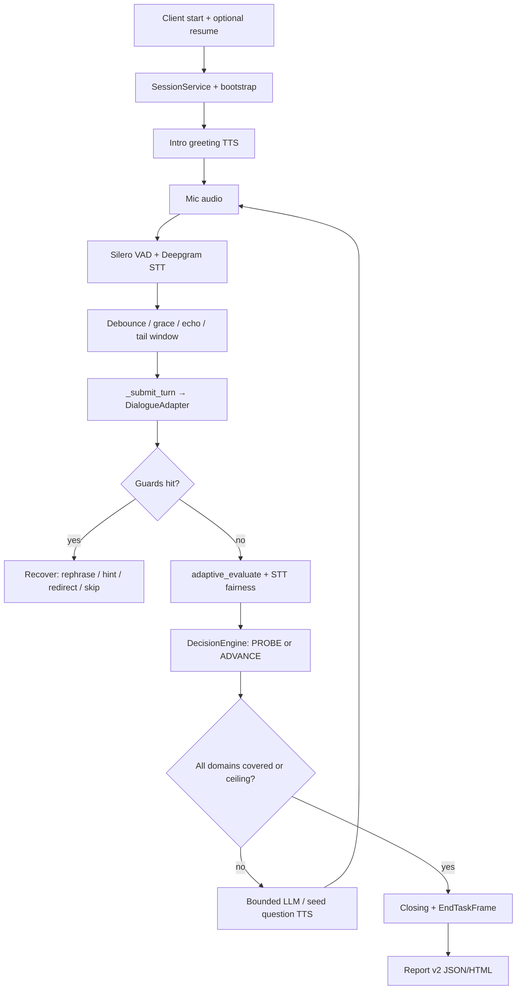

# AI-Based Real-Time Interview Simulator with Adaptive Questioning and Automated Evaluation

**Final Year Project Technical Report — Version 3.0**

---

| Field | Detail |
|-------|--------|
| **Project Title** | AI-Based Real-Time Interview Simulator with Adaptive Questioning and Emotion Analysis *(proposal title; emotion analysis deferred — see §16 and §19)* |
| **Institution** | Hamdard University Islamabad |
| **Supervisor** | Engineer Usman Javed |
| **Team** | Muhammad Usman, Taimur Ali Sakhawat, Bismah Khan Bangash, Eimaan Khan Bangash |
| **Academic Year** | 2025–2026 |
| **Repository** | `AI-interviewer-fyp-v2` |
| **Authoritative branch** | `uthman` |
| **Implementation snapshot** | Commit `5cb70095` (2026-07-17) — *Fix voice UX demo issues: domain asks, hints, short questions, STT fairness* |
| **Primary LLM** | Groq (`llama-3.3-70b-versatile`) |
| **STT / TTS / Voice** | Deepgram nova-2 · Cartesia · Pipecat + Silero VAD |
| **Supersedes** | `docs/FYP_FINAL_REPORT_V02.md` (v2.0, snapshot `64a7d784`) and `docs/FYP_FINAL_REPORT.md` (v1.0, snapshot `852bf7e`) |

> **Authority note.** This document is the **current master** FYP technical report. It was rebuilt from the live codebase on branch `uthman`, Git history through 2026-07-17, and post–Phase-6 documentation (coverage, voice turn-taking, tail fragments, memory continuity, canonical-question / resume UX, and voice UX demo fixes). Older reports (`FYP_FINAL_REPORT.md`, `FYP_FINAL_REPORT_V02.md`) remain historical reference only when they conflict with this file or the code.

---

## Table of Contents

1. [Project Overview and Objectives](#1-project-overview-and-objectives)
2. [Problem Statement](#2-problem-statement)
3. [Current Architecture](#3-current-architecture)
4. [System Design](#4-system-design)
5. [Complete Project Structure](#5-complete-project-structure)
6. [Technology Stack and Libraries](#6-technology-stack-and-libraries)
7. [Core Modules and Responsibilities](#7-core-modules-and-responsibilities)
8. [End-to-End Interview Workflow](#8-end-to-end-interview-workflow)
9. [AI Pipeline](#9-ai-pipeline)
10. [Backend Architecture and Service Interactions](#10-backend-architecture-and-service-interactions)
11. [Database and Storage](#11-database-and-storage)
12. [APIs and Communication Flow](#12-apis-and-communication-flow)
13. [Configuration and Deployment](#13-configuration-and-deployment)
14. [Features Implemented Phase by Phase](#14-features-implemented-phase-by-phase)
15. [Major Changes Since Report V2.0](#15-major-changes-since-report-v20)
16. [Major Architectural Decisions](#16-major-architectural-decisions)
17. [Improvements Since the Original Proposal](#17-improvements-since-the-original-proposal)
18. [Challenges Encountered and Resolutions](#18-challenges-encountered-and-resolutions)
19. [Current Implementation Status](#19-current-implementation-status)
20. [Remaining Work](#20-remaining-work)
21. [Conclusion](#21-conclusion)
22. [Appendix A — Git Evolution Timeline](#appendix-a--git-evolution-timeline)
23. [Appendix B — Documentation Index](#appendix-b--documentation-index)

---

## 1. Project Overview and Objectives

### 1.1 Overview

This Final Year Project delivers a **real-time AI voice interviewer** for Junior AI Engineer candidates. A candidate speaks into a browser microphone; the system transcribes speech, manages a structured multi-domain interview, evaluates answers with a transparent LLM rubric, asks adaptive follow-ups, and produces a recruiter-facing report (JSON + HTML).

The product demo path is a **Pipecat** WebSocket voice server. A **FastAPI** REST layer supports text-based testing and report retrieval. A modular **vanilla HTML/JS** manual client provides the live UI, conversation transcript, and report view.

As of July 2026, the system also includes **canonical question storage**, **bounded rephrase recoveries**, **reliable IDK/hint handling**, **resume-conditioned domain asks**, **short spoken questions**, and **broader STT fairness** — all without redesigning the SessionService or Pipecat pipeline shape.

### 1.2 Objectives — Status Against Delivery

| ID | Objective | Status (as of `5cb70095`) |
|----|-----------|---------------------------|
| O1 | Real-time voice interview simulation | **Achieved** — Pipecat + Deepgram + Cartesia + Silero |
| O2 | Dynamic adaptive questioning | **Achieved** — CoverageEngine + DecisionEngine + bounded LLM domain asks + Groq adaptive evaluate |
| O3 | Interruption (barge-in) handling | **Achieved with limits** — client RMS + server VAD grace; not ASR-gated |
| O4 | Emotional & behavioural evaluation | **Partially achieved** — six-dimension LLM rubric from text (clarity/confidence as proxies); **no SER/facial models** |
| O5 | Automated interview reporting | **Achieved** — Report v2 (`backend/reporting/`), completion tiers, HTML export |
| O6 | Reliability & evaluation methodology | **Achieved** — regression suite, noisy/STT fairness (including stutter / cleanup signals), human-study export API |

### 1.3 Scope of the Delivered System

**In scope (implemented):**

- Live browser voice interview (primary product path)
- Optional resume personalisation (skills, projects, domain-mapped evidence) and default Junior AI profile
- Ten-domain Junior AI Engineer blueprint with coverage-first wrap-up
- Six-guard pre-evaluation pipeline with canonical recoveries (no TTS prompt stacking)
- Adaptive PROBE / ADVANCE decisions with question deduplication and short spoken questions
- Six-dimension weighted rubric + borderline rethink ensemble
- Transcript quality assessment and broadened STT fairness reweighting
- Recent Q&A continuity in question (and light evaluator) prompts
- Live conversation events in the browser UI
- Report v2 with complete / partial / incomplete / aborted tiers
- Optional PostgreSQL persistence; in-memory fallback
- Human-study CSV/JSON export endpoint for κ validation
- Optional Groq prompt/reply debug logging under `DEBUG_LIVE_LOGGING`

**Out of scope (not implemented):**

- Speech Emotion Recognition and facial expression analysis
- Full IRT / CAT psychometric engine
- React/Firebase frontend and Docker/cloud deployment
- Multi-worker / multi-tenant concurrent voice sessions
- Vector memory, Redis, or RAG-based recall / full chat `messages[]` LLM history
- Job-description-conditioned interviews beyond the registered Junior AI blueprint
- PDF export (HTML/JSON exist)

---

## 2. Problem Statement

Candidates preparing for AI engineering roles lack accessible, realistic, repeatable interview practice. Existing tools often provide static question banks, text-only chatbots, or generic HR screens without domain-specific adaptive probing.

Automated voice interview systems frequently fail on:

1. **Latency and streaming** — acceptable STT → decision → TTS loops
2. **Turn-taking** — barge-in, silence, premature finalisation, STT tail fragments
3. **Non-answers** — echoes, meta-requests (“repeat”), IDK, off-topic speech scored as content
4. **Fairness** — communication scores punished by ASR noise rather than candidate ability
5. **Honesty in reporting** — interviews marked “complete” after covering only part of a skill blueprint
6. **Spoken UX** — recovery prompts stacking the same question multiple times; generic bank questions ignoring resume evidence; hint requests never reaching a hint path

This project addresses those failures with a guarded dialogue pipeline, coverage-first interview policy, transcript-fair evaluation, resume-aware domain questioning, and tiered reporting — delivered as a demonstrable end-to-end voice system suitable for academic evaluation.

---

## 3. Current Architecture

### 3.1 Runtime Faces, One Brain

```
┌────────────────────────────┐     ┌─────────────────────────┐
│  interview_bot.py          │     │  main.py (FastAPI)      │
│  WS :8765 + report HTTP    │     │  REST :8000             │
│  :8766                     │     │  (optional text WS)     │
└─────────────┬──────────────┘     └────────────┬────────────┘
              │                                 │
              └──────────────┬──────────────────┘
                             ▼
                  ┌──────────────────────┐
                  │   SessionService     │
                  │   (in-process store) │
                  └──────────┬───────────┘
                             ▼
                  ┌──────────────────────┐
                  │  DialogueManager     │
                  │  guards → eval →     │
                  │  decide → generate   │
                  └──────────────────────┘
```

| Entry point | Role |
|-------------|------|
| `backend/pipecat_integration/interview_bot.py` | **Primary product path** — live voice |
| `main.py` | REST API, testing, optional dev text WebSocket |
| `backend/pipecat_integration/manual_client/` | Browser mic client + live transcript + report UI |

Sessions share one `SessionService` **only within the same Python process**. Running the bot and FastAPI as separate processes yields separate session stores.

### 3.2 Voice Pipeline (Primary)

```
Browser mic (PCM over WebSocket)
  → Deepgram STT (interim + final frames)
  → InterviewProcessor
       • merge / debounce / echo gate / barge-in / silence / tail suppress
       • ConversationEventPublisher (UI bubbles + phase)
  → asyncio.to_thread(InterviewDialogueAdapter.process_user_text)
  → SessionService → DialogueManager.handle_turn
  → Cartesia TTS (TTSSpeakFrame)
  → WebSocket audio + conversation_event JSON → browser
  → on end: reporting.persistence → reports/*.json + HTML
```

### 3.3 Dialogue Pipeline (Every Scored Turn)

```
prepare_transcript_for_evaluation()
  → GuardPipeline (first trigger wins):
       Echo → Meta → IDK → Intent → Incomplete → Domain
  → Evaluator.adaptive_evaluate()
       → EvaluationPipeline (primary + optional rethink)
       → STT fairness weight adjustment (noisy / stutter / cleanup signals)
  → DecisionEngine.decide_from_adaptive()
       → CoverageEngine (domain progression, skip budget, wrap rules)
  → LLMAdapter.generate() when intro / advance needs a new question
       → domain seeds + resume evidence + recent Q&A + sliding history
  → set_active_question (canonical store) + question_dedup + output_sanitizer
  → InterviewContext update (+ optional Postgres save)
```

Guard recoveries (repeat / clarify / redirect / IDK) speak from **`current_canonical_question`** via `rephrase_policy.py` — never by stacking the previous full TTS string.

### 3.4 Context / Memory Model

The system does **not** replay a full chat `messages[]` history to Groq.

- Live state lives in **`InterviewContext`** (in-process via `SessionService`).
- Each Groq call is typically a **fresh system + constructed user prompt**.
- The last **three** answer-aware Q&A pairs are injected into technical / behavioural / follow-up prompts (and lightly into adaptive evaluation), with soft character caps.
- Question history shown to the LLM is a **sliding window of the last six questions**.
- **Canonical fields** on context: `current_canonical_question`, `current_domain_intent`, `resume_by_domain`.
- PostgreSQL stores sessions/responses for reports and recovery metadata; it is **not** read back into LLM prompts at runtime.

---

## 4. System Design

### 4.1 Interview Blueprint (Junior AI Engineer)

Fixed domain order (practical Q-matrix; not IRT/CAT), defined in `backend/core/interviewer_policy.py`:

1. `project_overview`
2. `python`
3. `machine_learning`
4. `data_preprocessing`
5. `model_evaluation`
6. `nlp_speech_ai`
7. `apis_backend`
8. `deployment`
9. `debugging_problem_solving`
10. `behavioral_ownership`

**Policy constants:**

| Constant | Value | Meaning |
|----------|-------|---------|
| `MAX_TURNS_PER_DOMAIN` | 1 | One primary question per domain |
| `MAX_PROBES_PER_DOMAIN` | 1 | One probe follow-up per domain |
| `MAX_TOTAL_INTERVIEW_TURNS` | **28** | Safety ceiling only |
| `MAX_SKIPS_PER_INTERVIEW` | **2** | Hard skip budget |
| `MAX_CONTEXT_FOLLOWUPS_TOTAL` | 3 | Context follow-up budget |

**Coverage-first wrap-up:** the interview does **not** close solely because turn count hit a low cap. Wrap-up prefers **full blueprint coverage**; the 28-turn limit is a safety ceiling. Soft phrases like “next question” **stay on the current question**; hard skips consume budget.

### 4.2 Interviewer Persona

The system **asks, evaluates, and redirects**. It does not coach or provide sample answers in normal flow. Persona rules and coaching blocklists live in `interviewer_policy.py` and are enforced in prompts and `output_sanitizer`.

**Controlled exception:** the IDK ladder may speak a short domain hint on attempt 2 (`Here's a small hint:`), then re-ask the canonical intent. Explicit “give me a hint” / “I don’t get it” phrases route through `IdkGuard` into that path.

### 4.3 Session Bootstrap and Resume Preference

Optional `resume_text` / `resume_data` / `display_name` / `target_role` flow through `session_bootstrap.py` into a `CandidateProfile`. Default role: `junior_ai_engineer`. Missing resume → `DEFAULT_CANDIDATE_PROFILE`.

Resume parsing (`resume_context_parser.py`) extracts:

- Skills (keyword / free-text)
- Simple **project** lines
- A lightweight **domain map** (`resume_by_domain`) — e.g. FastAPI → `apis_backend`, Docker → `deployment`, NLP/speech → `nlp_speech_ai`

When generating a domain primary, the system prefers **on-domain resume evidence** (and tagged resume questions) over generic bank wording. Technical domains use `DOMAIN_QUESTION_SEEDS` as intent seeds / fallback and do **not** fall back to the unrelated `role_specific` bank.

### 4.4 Canonical Question and Bounded Rephrase

| Mechanism | Role |
|-----------|------|
| `InterviewContext.set_active_question()` | Stores clean one-sentence intent when a primary or probe is committed |
| `canonicalize_for_store()` / `short_repeat_question()` | Strip recovery wrappers; dedupe repeated `?` clauses |
| `rephrase_policy.rephrase_recovery()` | Modes: `repeat` \| `clarify` \| `redirect` \| `simplify` — same meaning, new wording; single-paste fallback |

This prevents the July live-demo failure mode where TTS strings grew to contain the same core question three or four times after successive recoveries.

### 4.5 Evaluation Design

- **Method name:** `llm_rubric_ensemble_lite_v1`
- **Rubric version:** `1.0`
- **Six dimensions** with weights summing to 1.0 (see §9.5)
- **Borderline rethink:** second Groq pass when weighted score ∈ [2.2, 3.5] or dimension spread ≥ 1.5
- **STT fairness:** alternate weights reduce communication impact when transcript quality is poor — triggered by `is_noisy`, `stutter_prefix`, high `reduction_ratio`, repeated tokens, likely tail fragments, etc. (`evaluation/rubric.py`)
- **Profiles:** communication vs technical composites for reporting (Phase 6C)

### 4.6 Report v2 Design

`backend/reporting/` wraps legacy analytics into versioned reports:

- `report_version = "2.0"`
- Types: `complete` | `partial` | `incomplete` | `aborted`
- **Complete** requires wrap-up state, sufficient evaluated turns, and **~100%** blueprint coverage visited (assessed or explicitly skipped)
- HTML renderer + disk persistence; aborted sessions isolated under `reports/aborted/`
- Legacy top-level analytics keys mirrored for existing consumers

---

## 5. Complete Project Structure

```text
AI-interviewer-fyp-v2/
├── main.py                          # FastAPI REST entry
├── requirements.txt                 # Core: FastAPI, Groq, Postgres driver, …
├── requirements-pipecat.txt         # Pipecat + Deepgram + Cartesia + Silero
├── pytest.ini
├── .env.example
├── README.md                        # Setup notes (status lines may lag this report)
├── scripts/
│   └── run_regression.sh            # Official Phase 3–6+ + UX regression runner
├── docs/                            # Architecture, phase reports, QA, FYP reports
├── logs/                            # Runtime / live debug logs (incl. Groq traces)
├── reports/                         # Generated JSON/HTML (incl. aborted/)
└── backend/
    ├── core/
    │   ├── config.py                # Settings from .env
    │   ├── session_service.py       # Unified session singleton
    │   ├── role_registry.py         # target_role → blueprint
    │   ├── interviewer_policy.py    # Blueprint, limits, persona, spoken copy
    │   └── logging_config.py
    ├── dialogue/
    │   ├── dialogue_manager.py      # Turn orchestrator
    │   ├── context.py               # InterviewContext + canonical Q + recent Q&A
    │   ├── coverage_engine.py
    │   ├── decision_engine.py
    │   ├── llm_adapter.py           # Bounded domain asks + seeds + resume block
    │   ├── evaluator.py
    │   ├── evaluation_pipeline.py
    │   ├── prompts.py
    │   ├── session_bootstrap.py
    │   ├── resume_context_parser.py # Skills, projects, domain mapping
    │   ├── question_selector.py / question_bank.json
    │   ├── question_dedup.py
    │   ├── rephrase_policy.py       # Bounded recovery rephrase
    │   ├── idk_policy.py            # IDK ladder + broad detection + hints
    │   ├── transcript_utils.py / transcript_quality.py
    │   ├── followup_policy.py / output_sanitizer.py
    │   ├── analytics.py / recruiter_report.py / database.py
    │   ├── groq_debug_log.py        # Optional prompt/reply debug append
    │   ├── interview_flow_controller.py   # DEPRECATED
    │   └── guards/
    │       ├── pipeline.py
    │       ├── echo_guard.py
    │       ├── meta_conversation_guard.py
    │       ├── idk_guard.py
    │       ├── intent_guard.py
    │       ├── incomplete_guard.py
    │       ├── domain_guard.py
    │       ├── relevance.py
    │       └── types.py
    ├── evaluation/
    │   ├── rubric.py                # Weights + STT fairness triggers
    │   └── human_study_export.py
    ├── integration/
    │   └── dialogue_adapter.py      # Pipecat ↔ SessionService facade
    ├── pipecat_integration/
    │   ├── interview_bot.py
    │   ├── interview_processor.py
    │   ├── config.py
    │   ├── conversation/
    │   │   ├── events.py
    │   │   └── publisher.py
    │   └── manual_client/           # Modular browser demo
    │       ├── index.html / config.js / client.js
    │       ├── js/                  # app, audio, core, network, ui, report
    │       └── styles/
    ├── reporting/                   # Report v2
    │   ├── generator.py / builders.py / completion_policy.py
    │   ├── narrative.py / naming.py / persistence.py / schema.py
    │   └── renderers/html_renderer.py
    ├── voice/
    │   ├── voice_turn_policy.py     # Debounce, silence, barge, tail window
    │   ├── websocket_router.py      # Dev text WS (optional)
    │   └── …                        # Dev-only orchestrator helpers
    └── tests/                       # Official pytest / smoke suites
```

Workspace note: the Git root is `AI-interviewer-fyp-v2/`. Parent folder `application_v01/` may hold a local `venv/` and is not the repository root.

---

## 6. Technology Stack and Libraries

| Layer | Technology |
|-------|------------|
| Language | Python 3.12 |
| REST | FastAPI + Uvicorn + Pydantic |
| Voice framework | Pipecat (`pipecat-ai[deepgram,cartesia,websocket,silero]`) |
| STT | Deepgram (`nova-2`) |
| TTS | Cartesia |
| VAD | Silero (via Pipecat) |
| LLM | Groq API — Llama 3.3 70B (default); optional separate evaluator model |
| Database | Optional PostgreSQL via `psycopg2-binary` |
| Frontend demo | Vanilla HTML / CSS / JS (modular) |
| Config | `python-dotenv` + `core.config.Settings` |
| Testing | pytest harness + `scripts/run_regression.sh` |

**`requirements.txt`:** `fastapi`, `uvicorn`, `python-dotenv`, `psycopg2-binary`, `websockets`, `groq`  
**`requirements-pipecat.txt`:** `pipecat-ai[deepgram,cartesia,websocket,silero]`

There is **no** Dockerfile, docker-compose, Kubernetes, or CI config in this repository. Deployment is local Python + `.env`. There is **no** Node/`package.json` frontend — the demo UI is static HTML/JS under `manual_client/`.

---

## 7. Core Modules and Responsibilities

### 7.1 Core / Integration

| Module | Responsibility |
|--------|----------------|
| `SessionService` | In-process session CRUD; `start_interview` / `process_turn` |
| `config.Settings` | Typed env loading for LLM, STT, TTS, ports, turn timing |
| `interviewer_policy` | Blueprint, turn/skip ceilings, persona, closing copy |
| `role_registry` | Maps `junior_ai_engineer` → blueprint + defaults |
| `InterviewDialogueAdapter` | Plain-text bridge used by Pipecat processor |

### 7.2 Dialogue Brain

| Module | Responsibility |
|--------|----------------|
| `DialogueManager` | One-turn orchestrator: guards → eval → decide → generate |
| `DecisionEngine` | PROBE / ADVANCE / CLOSING under coverage and fragment safety |
| `LLMAdapter` | Groq questions: intro, bounded domain primary, behavioral, follow-up |
| `Evaluator` + `EvaluationPipeline` | Adaptive score + optional rethink ensemble |
| `CoverageEngine` | Domain covered / probed / advanced tracking |
| `InterviewContext` | Session state, coverage hooks, canonical Q, recent Q&A, resume map |
| `QuestionSelector` | Prefer on-domain resume Q → seeds → LLM |
| `rephrase_policy` | Same-intent recovery wording |
| `idk_policy` | Broad IDK detection; rephrase → hint → skip ladder |
| `output_sanitizer` / `question_dedup` | Strip coaching labels; block near-duplicate asks |

### 7.3 Guards (ordered, first hit wins)

| Guard | Purpose |
|-------|---------|
| Echo | STT echo of bot question |
| Meta | Soft stay vs hard skip; already-answered; previous-question replay |
| IDK | “I don’t know” / pass / hint-request without scoring |
| Intent | Repeat / clarify / other candidate intents |
| Incomplete | Tiny or truncated STT fragments |
| Domain | Semantic off-topic redirect (capped), using canonical rephrase |

### 7.4 Voice / Pipecat

| Module | Responsibility |
|--------|----------------|
| `interview_bot.py` | Assemble WS + STT + processor + TTS + report HTTP |
| `interview_processor.py` | Turn gating, `_submit_turn`, silence nudges, closing |
| `VoiceTurnPolicy` | Debounce, echo cooldown, short-answer grace, tail resume window |
| `conversation/publisher.py` | Emit live `conversation_event` frames to the UI |

### 7.5 Reporting / Evaluation

| Module | Responsibility |
|--------|----------------|
| `reporting/*` | Report v2 generation, tiers, HTML, persistence |
| `evaluation/rubric.py` | Dimension weights, hire thresholds, STT fairness triggers |
| `human_study_export.py` | CSV/JSON export for inter-rater studies |

### 7.6 Manual Client

Modular layout under `manual_client/js/`:

- `network/voiceSession.js` — WebSocket + mic PCM16
- `audio/bargeInController.js` / `playbackController.js` — barge-in + TTS playback
- `core/conversationStore.js` — apply conversation events
- `ui/*` — status, visualizer, conversation bubbles, report render
- `network/reportClient.js` — fetch latest / session-scoped report

---

## 8. End-to-End Interview Workflow



### Step narrative

1. **Start** — Client sends `{type:"start", target_role:"junior_ai_engineer", display_name?, resume_text?}`. Bootstrap builds profile; intro speaks without scoring. With resume present, intro is instructed to name a concrete skill/project.
2. **Listen** — Mic PCM → Deepgram interim/final; Silero speaking frames; `VoiceTurnPolicy` debounce (~3s), short-answer grace, startup gate, bot-echo cooldown, post-submit tail-fragment window.
3. **Turn-taking** — Silence nudge (~8s) / rephrase (~15s); client RMS barge-in can send `interrupt`; server VAD grace reduces false barge-ins.
4. **Guards** — Non-answers never reach the rubric. Soft “next question” stays; hard skip consumes budget (max 2). IDK ladder: simplify → hint → skip domain.
5. **Evaluate** — Six-dimension score; optional rethink; fairness reweight on STT artifacts.
6. **Decide** — At most one probe per domain; otherwise advance. When blueprint exhausted (or safety ceiling 28), close.
7. **Ask** — Commit canonical question; TTS one short spoken line (~25-word soft cap for domain primaries).
8. **Report** — Persist Report v2; client auto-loads from report HTTP (`:8766`).

---

## 9. AI Pipeline

### 9.1 Speech-to-Text (Deepgram)

- Model: `nova-2` (configurable)
- Streaming interim + final hypotheses
- Keyword boosting for domain terms (e.g. FastAPI, Qdrant) via settings
- Endpointing and merge utilities reduce orphan micro-fragments

### 9.2 Voice Activity Detection (Silero)

- Speaking start/stop frames drive debounce and barge-in grace
- Diagnostic subclass in `interview_bot.py` supports live debugging

### 9.3 Interruption / Barge-in

- **Client:** RMS threshold + consecutive frames (`config.js`, query overrides)
- **Server:** VAD grace and echo cooldowns; barge buffer handling after interrupt
- **Not implemented:** ASR-gated barge-in (content-aware)

### 9.4 Dialogue Management

- State machine: INTRO → TECHNICAL (blueprint domains) → WRAPUP  
  (`behavioral_ownership` is the final blueprint domain; no separate multi-turn behavioral loop after coverage)
- Guard pipeline before any scoring
- Canonical store + bounded rephrase for recoveries
- Coverage-first ADVANCE / CLOSING policy

### 9.5 Evaluation Rubric

| Dimension | Default weight | Notes |
|-----------|----------------|-------|
| structure | 0.25 | Answer organisation |
| result_orientation | 0.20 | Outcomes / impact |
| ownership | 0.20 | Personal responsibility |
| leadership | 0.15 | Influence / coordination |
| clarity | 0.10 | Communication clarity |
| confidence | 0.10 | Delivery confidence |

**Hire signal bands** (weighted): strong hire ≥ 4.2, hire ≥ 3.4, borderline ≥ 2.5.

**Noisy / artifact STT weights** lower clarity/structure impact and raise technical dimensions when fairness triggers fire.

### 9.6 Question Generation (Groq)

- Intro: one LLM greeting; resume-aware when `profile_source == "resume"`
- Technical domain primary path: on-domain resume Q → naturalized seed → bounded LLM (domain + seed + resume evidence + recent Q&A) → seed fallback
- Reject multi-`?` / overlong LLM text; soft clip on commit
- Follow-ups: probe / context follow-up with continuity memory
- Optional debug: `GROQ_*_PROMPT` / `GROQ_*_REPLY` lines in `logs/live_interview_debug.log`

### 9.7 Text-to-Speech (Cartesia)

- Spoken responses via `TTSSpeakFrame`
- Closing uses single-source copy from `interviewer_policy`
- Chunk-gap redesign is out of scope

### 9.8 Reporting

- Analytics → Report v2 generator → JSON (+ HTML)
- Completion policy enforces honest tiers vs blueprint coverage
- Manual client renders report sections in-browser

---

## 10. Backend Architecture and Service Interactions

```
manual_client (browser)
    │  PCM + JSON control (start / interrupt)
    ▼
interview_bot (Pipecat WS :8765)
    │  STT frames
    ▼
InterviewProcessor
    │  asyncio.to_thread
    ▼
InterviewDialogueAdapter
    │
    ▼
SessionService ──► DialogueManager ──► Guards / Evaluator / DecisionEngine / LLMAdapter
    │
    ├── optional database.save_*
    └── on close: reporting.persistence → reports/

Report HTTP (:8766) ◄── manual_client reportClient
FastAPI (:8000) ──► SessionService (same process only)
```

**Threading note:** Groq calls run in a worker thread from the Pipecat event loop so STT/TTS frames are not blocked (Phase 5 hardening).

**Deprecated:** `dialogue/interview_flow_controller.py` is not on the Pipecat product path; CoverageEngine + DialogueManager supersede it.

---

## 11. Database and Storage

### 11.1 Optional PostgreSQL

Functions in `dialogue/database.py`: `create_tables`, `save_session`, `save_response`, `update_session_finals`, `get_latency_metrics`, `list_sessions`, …

If `DATABASE_URL` is unset or connection fails, the system continues with **in-memory sessions** and file-based reports.

### 11.2 File Storage

| Path | Contents |
|------|----------|
| `reports/` | Completed / partial interview JSON (+ HTML) |
| `reports/aborted/` | Sessions with no evaluated turns |
| `logs/` | Application and optional live interview debug log (incl. Groq traces) |

### 11.3 What Is *Not* Stored as LLM Memory

Postgres and report files are **not** fed back into prompts. Continuity is selective fields on `InterviewContext` only (see `docs/FYP_MEMORY_CONTINUITY.md`).

---

## 12. APIs and Communication Flow

### 12.1 FastAPI REST (`main.py`, port 8000)

| Method | Path | Purpose |
|--------|------|---------|
| POST | `/start` | Create session + intro |
| POST | `/chat` | Process answer → next question + evaluation |
| GET | `/session/{session_id}` | Status + aggregates |
| GET | `/roles` | Available target roles |
| GET | `/health` | Health + active session count |
| GET | `/export/human-study/{session_id}` | κ-study export (`fmt=json\|csv`) |
| GET | `/report/{session_id}` | Full final report |
| GET | `/report/hr/{session_id}` | Recruiter report |
| GET | `/sessions` | List sessions |
| GET | `/sessions/rank` | Rank candidates |
| GET | `/sessions/{session_id}/summary` | Compact summary |

Optional when `ENABLE_DEV_TEXT_VOICE_WS=true`:

| Method | Path | Purpose |
|--------|------|---------|
| WS | `/ws/interview/{session_id}` | Dev text simulation |
| GET | `/voice/sessions` | List active dev voice sessions |

### 12.2 Pipecat Voice WebSocket (port 8765)

- Binary PCM audio up/down
- JSON control: `start`, `interrupt` (client `end` ignored so reconnect does not tear down STT/TTS)
- Server emits `conversation_event` payloads (`message`, `phase`, `session`) for the live UI

### 12.3 Report HTTP (port 8766)

- `GET /latest-report` — latest report artifact helper for demos
- Manual client prefers **session-scoped** report loading where available to avoid stale cross-session results

---

## 13. Configuration and Deployment

### 13.1 Environment Configuration

Copy `.env.example` → `.env`. Groups include:

- **Groq:** `GROQ_API_KEY`, `GROQ_MODEL`, `GROQ_EVALUATOR_MODEL`
- **Deepgram / Cartesia:** API keys, model, voice ID, STT tuning
- **Ports:** `PIPECAT_WS_HOST/PORT`, `REPORT_HTTP_PORT`
- **Voice timing:** debounce, grace, echo cooldowns, silence nudge/rephrase, barge-in grace, tail resume window / max words
- **Logging:** `LOG_LEVEL`, `PROCESSOR_LOG_FRAMES`, `DEBUG_LIVE_LOGGING` (also enables Groq prompt/reply traces)
- **Database:** `DATABASE_URL` (optional)
- **Flags:** `ENABLE_DEV_TEXT_VOICE_WS`

Canonical documentation: `docs/CONFIGURATION.md`.

### 13.2 Local Runbook

```powershell
cd AI-interviewer-fyp-v2
python -m venv venv
venv\Scripts\activate
pip install -r requirements.txt -r requirements-pipecat.txt
copy .env.example .env   # add keys

# Terminal 1 — voice bot
python backend\pipecat_integration\interview_bot.py

# Terminal 2 — browser client
cd backend\pipecat_integration\manual_client
python -m http.server 3000
# open http://localhost:3000

# Optional REST
uvicorn main:app --reload

# Regression
bash scripts/run_regression.sh
```

### 13.3 Deployment Reality

| Proposed / aspirational | Current |
|-------------------------|---------|
| Docker / AWS / GCP / Render | **Not implemented** |
| Multi-instance load balancing | **Not implemented** |
| Shared session store (Redis) | **Not implemented** — single-process memory |

Production demos today are **local machine** setups with cloud STT/TTS/LLM APIs.

---

## 14. Features Implemented Phase by Phase

### Phase 1 — Unified Core

- `SessionService` singleton for REST and voice
- Central config and interviewer policy extraction

### Phase 2 — Dialogue Core / Guards

- Guard pipeline before scoring
- Transcript utilities, follow-up policy, output sanitizer
- Interviewer-mode persona (ask / redirect, do not coach)

### Phase 3 — Structured Flow & Optional Resume

- `role_registry`, `session_bootstrap`, `CoverageEngine`
- Resume-aware intro / project questions; default profile fallback
- Deprecation of `InterviewFlowController` on product path

### Phase 4 — Evaluation Engine

- Central `evaluation/rubric.py`
- Lite ensemble rethink on borderline answers
- Human-study export API
- Methodology metadata in reports

### Phase 5 — Production Hardening (Voice Operability)

- `VoiceTurnPolicy` + config-driven timing
- `asyncio.to_thread` for non-blocking Groq in Pipecat loop
- Structured logging; regression script; architecture docs
- Unified `_submit_turn` in `InterviewProcessor`

### Phase 6A — Interview Flow Quality

- Meta + IDK guards; question dedup; domain tracking fixes

### Phase 6B — Transcript Fairness

- Transcript quality assessment
- Noisy-STT reweighting of communication dimensions
- Deepgram tuning knobs

### Phase 6C — Reporting Clarity

- Communication vs technical score profiles
- `domain_assessment_map` with `not_assessed`
- Interview completion summary fields

### Phase 6 Voice Quality + Hotfixes

- Silence nudge/rephrase, STT merge quality, barge-in thresholds
- Natural opener rotation / softer redirects
- Reconnect without tearing down STT/TTS

### Post–Phase 6 Product Work (through mid-July 2026)

| Area | Implementation |
|------|----------------|
| Semantic domain relevance | LLM relevance checks; redirect caps |
| Modular manual client | `js/` + `styles/` architecture |
| **Report v2 package** | `backend/reporting/` + HTML + tiers |
| Live conversation wire | `conversation_event` end-to-end |
| Voice turn-taking QA | Premature interim gates, barge buffer, auto-load report |
| **Full blueprint coverage** | Turn ceiling 28; complete ≈ 100% coverage; skip budget 2 |
| Tail fragment fix | Processor resume window + guard/decision safety nets |
| **Recent Q&A memory** | Last 3 pairs in question prompts; sliding history |
| **Canonical Q + rephrase + resume domains** | July 17 UX refinements (`75cbdb5`) |
| **Voice UX demo fixes** | Domain seeds path, hint routing, short asks, STT fairness breadth, Groq debug (`5cb7009`) |

---

## 15. Major Changes Since Report V2.0

Report V2.0 froze at `64a7d784` (recent Q&A memory). **V3.0** incorporates two subsequent product commits on `uthman`:

### 15.1 Canonical Question, Rephrase, Resume Preference (`75cbdb5`)

| Problem (live July logs) | Fix |
|--------------------------|-----|
| TTS multi-ask stacking after recoveries | `current_canonical_question` store; recoveries never paste prior full TTS |
| Identical-feeling recoveries | Bounded LLM rephrase (`rephrase_policy.py`) with single-paste fallback |
| Long “I don’t know… pass” missed → DomainGuard | Broader `is_idk_response`; attempt 2 = hint + fresh ask |
| Hardcoded bank as spoken primary | Seeds + bounded LLM with domain constraints |
| Resume underused outside project/behavioral | Projects extraction + `resume_by_domain` + on-domain preference |

**Intentionally unchanged:** soft “next” stays on domain; hard skip budgeted; coverage-first wrap-up.

Docs: `docs/CANONICAL_QUESTION_AND_RESUME.md`  
Tests: `backend/tests/test_canonical_question_and_resume.py`

### 15.2 Voice UX Demo Fixes (`5cb7009`)

| Problem | Fix |
|---------|-----|
| Technical domains falling into `role_specific` bank | Strict path: on-domain resume → seeds → bounded LLM → seed |
| “Give me a hint” / “I don’t get it” not hinting | Route through `IdkGuard` → `hint_idk` |
| Long multi-clause spoken questions | ~25-word prompt constraint; reject multi-`?` / overlong; soft clip |
| Fairness only on `is_noisy` | Also stutter prefix, reduction ratio, related flags |
| Hard to debug Groq | `DEBUG_LIVE_LOGGING` appends prompt/reply traces |

Docs: `docs/VOICE_UX_DEMO_FIXES.md`  
Tests: `backend/tests/test_voice_ux_demo_fixes.py`

---

## 16. Major Architectural Decisions

| Decision | Choice | Why |
|----------|--------|-----|
| Voice framework | Pipecat | Frame-based STT/TTS/VAD composition for live demos |
| LLM provider | Groq Llama 3.3 70B | Latency + JSON adherence for eval/questions |
| STT / TTS | Deepgram / Cartesia | Streaming quality for live interviews |
| Frontend | Modular vanilla JS | Faster FYP delivery than React/Firebase rewrite |
| Adaptivity | Fixed blueprint + probes | Thesis-defensible without IRT item calibration data |
| Non-answer handling | Ordered guard pipeline | Live tests showed evaluator scoring echoes/meta/IDK |
| Sessions | In-process singleton | Sufficient for single-demo FYP; cross-process deferred |
| Reports | Dedicated `reporting/` v2 | Separates recruiter UX from analytics internals |
| Completion honesty | ~100% coverage for `complete` | Mid-blueprint “complete” reports were misleading |
| Memory | Selective InterviewContext + recent Q&A | Avoid Memory Manager / RAG complexity for FYP |
| Recovery speech | Canonical store + bounded rephrase | Prevent TTS stacking without redesigning Pipecat |
| Domain asks | Seeds + bounded LLM + resume map | Keep domain stickiness while sounding less bank-rigid |
| Emotion | Deferred | Scope, data, and integration cost vs voice robustness |

---

## 17. Improvements Since the Original Proposal

The original proposal envisioned multimodal emotion/facial analysis, a React/Firebase stack, and stronger psychometric adaptivity. The delivered system strengthened **voice dialogue robustness and evaluation methodology** instead.

| Aspect | Proposed (intent) | Implemented today |
|--------|-------------------|-------------------|
| Emotion / facial | SER + webcam CNN | Not implemented; text proxies via rubric |
| Adaptive testing | Dynamic / CAT-like | 10-domain Q-matrix + 1 probe/domain |
| Frontend | React.js | Modular HTML/JS manual client |
| Database | Firebase / MySQL | Optional PostgreSQL + JSON/HTML files |
| Deployment | Cloud containers | Local Python + `.env` (no Docker) |
| LLM | Unspecified / Gemini in some materials | **Groq** (not Gemini) |
| STT | Whisper-class | **Deepgram nova-2 streaming** |
| Interruption | Stress simulation | Functional barge-in + silence nudges |
| Evaluation | Multimodal fusion | Auditable 6-dim LLM rubric + rethink + fairness |

**Added beyond the proposal** because live testing demanded them: six-guard pipeline, Phase 6B transcript fairness, IDK/hint policy, Report v2 tiers, live conversation UI events, full-coverage wrap policy, tail-fragment turn safety, recent Q&A prompt continuity, canonical recoveries, resume-domain preference, short spoken domain asks, and Groq debug logging.

---

## 18. Challenges Encountered and Resolutions

| Challenge | Evidence | Resolution |
|-----------|----------|------------|
| Non-answers scored as content | Phase 2 / 6A docs | Guard pipeline before evaluation |
| Domain / question loops | Phase 6A | `set_current_domain`, dedup, coverage fixes |
| Sync Groq blocking voice loop | Phase 5 | `asyncio.to_thread` in processor |
| Hardcoded voice timings | Phase 5 | `VoiceTurnPolicy` + `.env` |
| Unfair scores from noisy STT | Phase 6B + demo fixes | Quality assess + broadened fairness triggers |
| False barge-in / reconnect silence | Phase 6 hotfixes | Grace windows; no EndFrame teardown on soft disconnect |
| Interview ends mid-blueprint as “complete” | `FULL_COVERAGE_INTERVIEW.md` | Ceiling 28; complete needs full coverage |
| Soft “next question” skipped domains | Same | Stay-on-question vs hard skip budget |
| Early STT finalisation → orphan tails | `VOICE_TAIL_FRAGMENT_FIX.md` | Resume window + guard/decision nets |
| Stale `/latest-report` across sessions | Turn-taking QA | Session-scoped report client loading |
| Live transcript lost after hard reset | `WIRE_LIVE_CONVERSATION.md` | Re-wire `conversation_event` publisher ↔ UI |
| Weak follow-up continuity | `FYP_MEMORY_CONTINUITY.md` | Inject last 3 Q&A; sliding question window |
| TTS prompt stacking / identical recovers | July 16 logs + `CANONICAL_*` | Canonical store + bounded rephrase |
| Hints rare; long IDK → domain redirect | Same + demo fixes | Broader IDK + hint-request routing |
| Wrong-bank technical questions | Demo session `30b963f8` | Domain-seed path; no `role_specific` fallback |

---

## 19. Current Implementation Status

### 19.1 Snapshot

| Item | Status |
|------|--------|
| Branch | `uthman` @ `5cb70095` (2026-07-17) |
| `main` branch | Frozen early (README era); **not** the product line |
| Phase 1–5 | Complete |
| Phase 6A–6C + voice quality | Complete |
| Report v2 + modular client | Complete |
| Full-coverage policy | Complete |
| Tail-fragment + recent Q&A memory | Complete |
| Canonical question / rephrase / resume domains | Complete |
| Voice UX demo fixes (seeds, hints, short asks, fairness, Groq debug) | Complete |
| Official tests | `backend/tests/` + `scripts/run_regression.sh` (includes canonical + demo UX suites) |
| Docker / multi-tenant / SER / facial / IRT | Not implemented |

### 19.2 Production Readiness Statement

The system is **production-ready for dialogue/pipeline correctness** under automated regression, with **ongoing live-voice validation** recommended for silence/barge timing on each demo machine. Root `README.md` lines that still say “Phase 5 complete” are **stale** relative to this report — prefer this document and the July 2026 `docs/*` QA notes.

### 19.3 Known Soft Edges (Still True)

- Echo guard can occasionally misclassify real answers
- STT can still produce awkward chunks despite merge/cleanup
- Silence timing is wall-clock after bot-stop settle
- Barge-in is energy/VAD-based, not ASR-gated
- Cartesia chunk gaps not redesigned
- Human κ study export exists; human ratings not yet collected as an automated project deliverable
- Selective memory is not a full conversational Memory Manager (by design)

---

## 20. Remaining Work

Only items that are **genuinely unfinished** relative to proposal vision or documented follow-ups:

| Item | Priority | Notes |
|------|----------|-------|
| Human inter-rater (κ) validation study | High (thesis) | Export API ready |
| Docker / cloud deployment packaging | Medium–High | Not in repo |
| Speech emotion / facial analysis | Proposal-high, currently deferred | Explicit scope cut |
| Multi-role blueprints beyond Junior AI | Medium | Registry pattern ready |
| Multi-client / shared session store | Medium | Architecture limit today |
| React production frontend | Low–Medium | Manual client sufficient for FYP demo |
| Full IRT/CAT | Low (deferred) | Would need calibration data |
| ASR-gated barge-in; skip-after-double-silence | Low | Documented optional follow-ups |
| PDF export | Low | HTML/JSON exist |
| Memory Manager / RAG / Redis | Explicitly rejected for FYP | See `FYP_MEMORY_CONTINUITY.md` |

---

## 21. Conclusion

This project delivers a working **real-time AI voice interviewer** with structured domain coverage, guarded dialogue, transparent LLM evaluation, resume-aware questioning, and recruiter-oriented Report v2 output. Development followed a clear evolution: an initial monolithic prototype (June 2026), a five-phase modularisation (core → guards → coverage → evaluation → voice hardening), Phase 6 quality/fairness work, and a dense July stream of live-voice, reporting, and spoken-UX fixes.

Where the original proposal emphasised multimodal emotion sensing and psychometric CAT, the team deliberately invested in **voice turn-taking reliability, non-answer handling, evaluation auditability, honest completion reporting, and spoken recovery quality** — the failure modes that blocked a credible live demo. The result on branch `uthman` (commit `5cb70095`) is a coherent, testable system that someone can run locally, interview against a Junior AI Engineer blueprint — optionally with a resume — and obtain a versioned report with explicit limitations.

This **Version 3.0** report is the authoritative description of that system. Earlier narrative documents — including `FYP_FINAL_REPORT.md` (v1.0) and `FYP_FINAL_REPORT_V02.md` (v2.0) — should be treated as historical when they conflict with this file or the current code.

---

## Appendix A — Git Evolution Timeline

Repository: `AI-interviewer-fyp-v2` · Remote: `origin` · Product branch: **`uthman`** · Tags: none.

| Date | Commit | Theme |
|------|--------|-------|
| 2026-06-24 | `de98129`, `0bf36d1` | Initial commit + README; **`main` stops** |
| 2026-06-29 | `65e6d91` … `6d1131f` | Refactors Phases 1–5 |
| 2026-07-03 | `017fd0d` | Disable Pipecat idle timeout |
| 2026-07-07 | `534b860`, `379744c`, `852bf7e` | Phase 6A–C + reconnect/speech capture + loop fixes *(v1 report snapshot)* |
| 2026-07-08 | `e832282` | Phase 6 voice quality completion |
| 2026-07-10 | `26f1195`, `64ac1a8`, `cb16cf6` | Semantic guards; modular client; **Report v2** |
| 2026-07-13–15 | `d253db4` … `4c5f1b4` | Dev log; turn-taking; live transcript wire; **full coverage**; cleanup |
| 2026-07-16 | `f69dd6c`, `0a3c7f9`, `64a7d784` | Tail-fragment fix + docs; **recent Q&A memory** *(v2 report snapshot)* |
| 2026-07-17 | `ca9cbcd` | FYP report V02 document commit |
| 2026-07-17 | `75cbdb5` | **Canonical question / rephrase / resume-aware asks** |
| 2026-07-17 | `5cb7009` | **Voice UX demo fixes** *(this report’s snapshot)* |

Highest-churn modules historically: `dialogue_manager.py`, `interview_bot.py`, `interview_processor.py`, `llm_adapter.py`.

---

## Appendix B — Documentation Index

| Document | Use |
|----------|-----|
| **This file (`FYP_FINAL_REPORT_V03.md`)** | **Authoritative current FYP technical report** |
| `FYP_FINAL_REPORT_V02.md` | Historical — snapshot `64a7d784` |
| `FYP_FINAL_REPORT.md` | Historical — snapshot `852bf7e` |
| `ARCHITECTURE.md` | Runtime overview |
| `DIALOGUE_PIPELINE.md` | Guard/eval flow (prefer code if lists differ) |
| `INTERVIEW_FLOW.md` | Resume + coverage (Phase 3) |
| `CONFIGURATION.md` | Env vars including tail-fragment + Groq debug |
| `PHASE_*_COMPLETE.md` | Phase deliverables 3–6 |
| `FULL_COVERAGE_INTERVIEW.md` | Coverage-first wrap-up policy |
| `VOICE_TURN_TAKING_FIXES.md` | July turn-taking QA |
| `VOICE_TAIL_FRAGMENT_FIX.md` | Tail fragment July 15/16 |
| `WIRE_LIVE_CONVERSATION.md` / `LIVE_CONVERSATION_TRANSCRIPT.md` | Live UI events |
| `FYP_MEMORY_CONTINUITY.md` / `memory.md` | Memory design + recent Q&A |
| `CANONICAL_QUESTION_AND_RESUME.md` | Canonical store, rephrase, resume domains |
| `VOICE_UX_DEMO_FIXES.md` | Domain seeds, hints, short asks, fairness, Groq debug |
| `PERFORMANCE.md` | Async / logging tuning |
| `MANUAL_TEST_GUIDE.md` | Manual demo checklist |
| `DEVELOPER_ONBOARDING.md` | Onboarding notes |
| `PROJECT_CLEANUP_REPORT.md` | Deleted vs retained artifacts |
| `dev_file.md` | Developer mental model through Report v2 era |

---

*End of Report V3.0 — generated to match implementation on branch `uthman`, commit `5cb70095`.*
